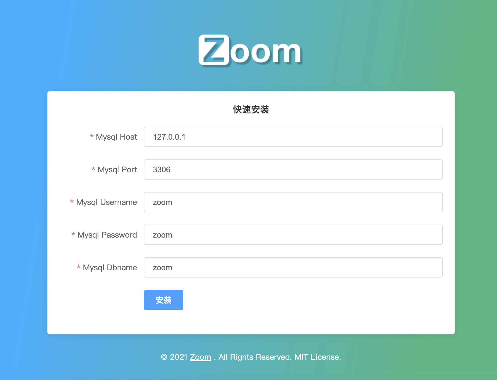

# 安装

安装 Zoom 非常简单，若您在安装过程中遇到问题或无法找到解决方式，请[提交Issue](https://github.com/zoom-ci/zoom-ci/issues)，我们会尽力解决您的问题。

## 环境需求

**操作系统**

Linux / macOS + Bash. 需要注意的是Zoom不支持Win系统。

**MySQL**

MySQL 5.6+

**Git**

升级操作系统Git到最新版本。

## 运行及安装

下载[最新版本release包](https://github.com/zoom-ci/zoom-ci/releases),并将其拷贝到任意目录（比如：~/zoom_workspace）;

```shell
$ ./zoom-v1.0.0-darwin-amd64   # 这里以mac 64位版为例 

 _____________________________
       ___                    
         /                    
 -------/-----__----__---_--_-
       /    /   ) /   ) / /  )
 ____(_____(___/_(___/_/_/__/_
     / Zoom,a CI/CD service.  
 (_ /                         


Service:              zoom
Version:              v1.0.0
Config Loaded:        ./zoom.ini
Log:                  stdout
Mail Enable:          0
HTTP Service:         :7002
Start Running...
```

打开浏览器，访问 `http://localhost:7002` (出现下图界面)，配置数据库，安装完成。


初始账号：
```
用户名: admin
密码: 123456
```
**!!!登录后尽快修改默认密码**

[filename](include/footer.md ':include')